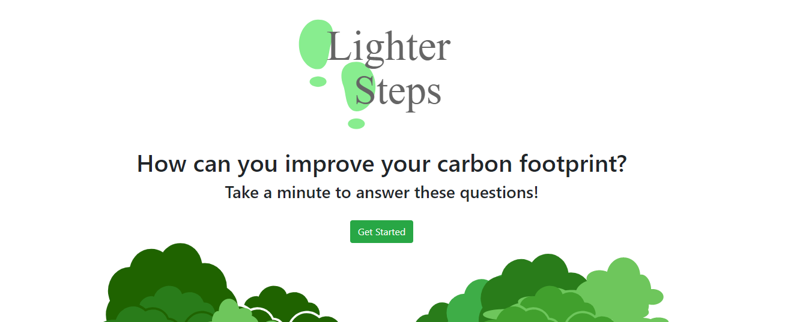
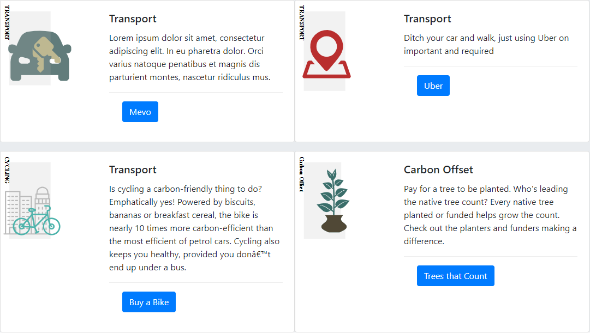
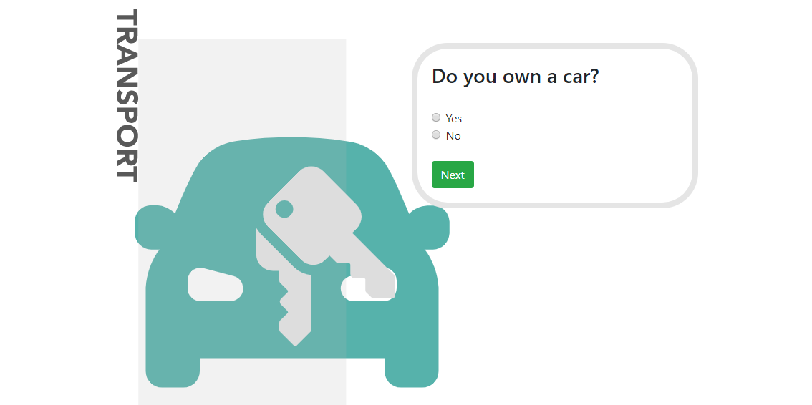
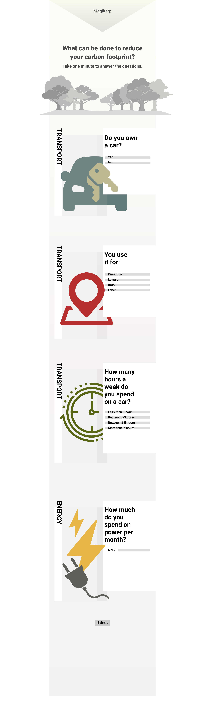
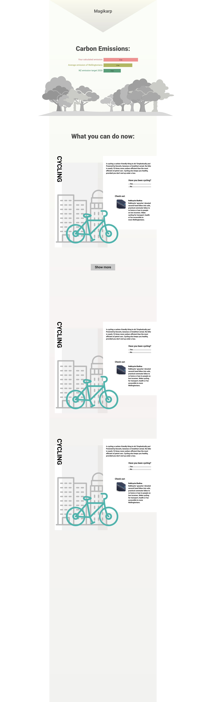

# Summer of Tech - Create Camp Hackathon
## Carbon Footprint
Summer of Tech Create Camp 2019 - Personalised Environmental Impact Advice

## Purpose - Personalised Environmental Impact Advice

User Story: As a user I should be able to see my impact compared to the New Zealand Average

User Story: As a user I should be able to see my impact compared to the New Zealand Emmission target for 2020 

User Story: As a user I should be able to get a useful/interesting result without spending large amounts of time entering data

User Story: As a user I should be able to recieve advice on lowering my carbon footprint, designed for me or people like me

### Features
+ Solution Cards for how to reduce impact
+ Simple development/addition of solution cards by adding solutions to the JSON response in the "getSolutions" method in cards.js
+ Interactive addition/display of trees, allowing for carbon load to be displayed in a relatable way. *Note: The method allows for the number of trees drawn to be changed at any time, the image is procedurally generated* 
+ Responsive design that works on mobile and desktop

## Development
Development was part of a Summer of Tech, Create Camp event on 25/8/2019. 

Within the first day an idea had been decided on to present a Carbon Calculator that has information in a more easily understandable way, and additionally to be able to help users to find information on how to improve thier carbon footprint.
The site was running on Heroku within 3 hours of the agreed theme and a CI pipeline was established with a common git account to ensure a focus on a deliverable product.
By the end of the second day an MVP was produced and a presentation made about the product.

### Team
The team was made from four developers and one designer. There were multiple levels of experience and familiarity with web or mobile development across the team. 
Additionally a mentor was always at hand to provide help and guidance, including overcoming some technical challenges and helping to organise planning sessions.

### Processes
+ Development was done with some aspects of agile development, including regular meetings to talk about progress. 
+ The designer on the team was heavily involved and the final product reflects the ability of the designer and developers to work together toward a common vision.
+ Work was divided into parts to allow for parallel development, with the parts being treated simmilarly to components, designed to be combined after completion

### Challenges
+ Few of the members of the team had large amounts of recent web development experience, one of the impacts this had was to use jQuery and string manipulation where React components or other technologies may have worked better
+ On the start of the second day one of the 4 developers was struck ill and unable to participate

# Design

